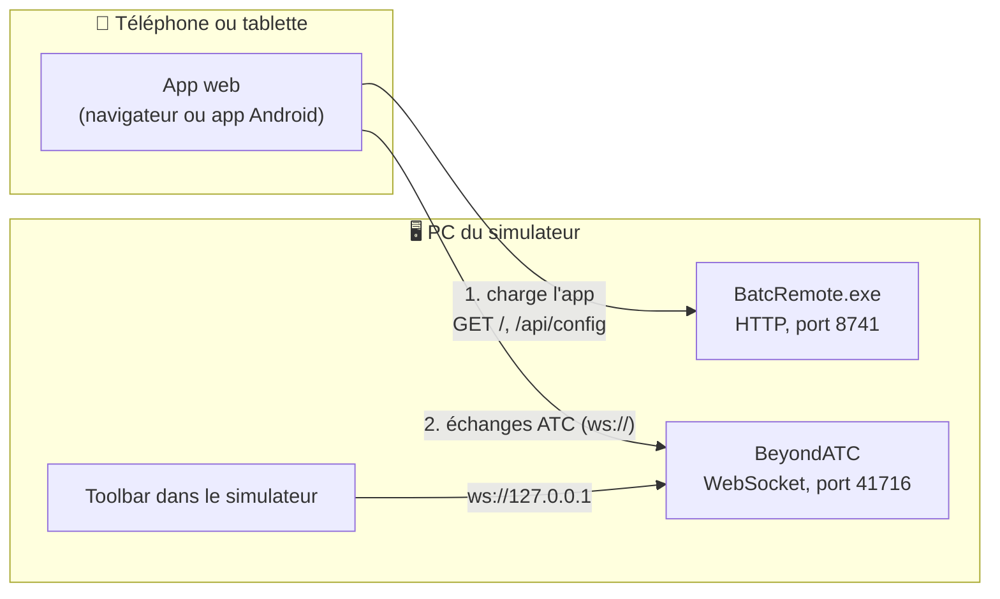
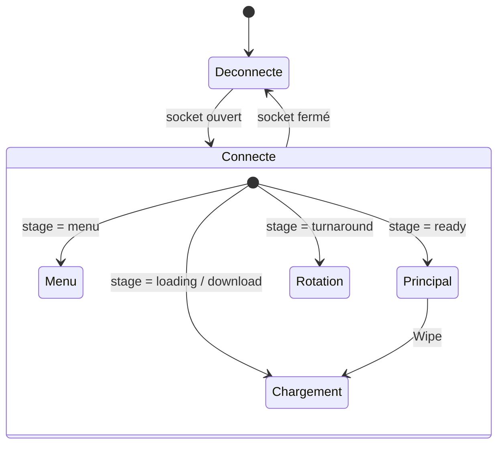

# BATC Remote — Guide technique

[English](TECHNICAL.md) · **Français**

Ce guide explique le fonctionnement de BATC Remote : son architecture, ses différentes parties, le protocole BeyondATC qu'il utilise, et la façon dont il est compilé et testé. Pour l'installation et l'utilisation au quotidien, voir le [README](../README-FR.md).

> [!NOTE]
> BATC Remote est un outil communautaire indépendant. Il n'est pas supporté et n'est pas un outil officiel BeyondATC.
> Le protocole décrit ci-dessous **n'est pas une spécification officielle**. Il a été établi à partir de la toolbar BeyondATC (v3.1) et de l'enregistrement d'un vol IFR réel de 36 minutes, et peut changer à chaque mise à jour de BeyondATC.

## Sommaire

1. [Architecture](#1-architecture)
2. [App web](#2-app-web)
3. [BatcRemote.exe (hôte Windows)](#3-batcremoteexe-hôte-windows)
4. [App Android](#4-app-android)
5. [Protocole BeyondATC](#5-protocole-beyondatc)
6. [Comportement du client et règles de temps](#6-comportement-du-client-et-règles-de-temps)
7. [Tests et outils](#7-tests-et-outils)
8. [Limites et sécurité](#8-limites-et-sécurité)
9. [Quand BeyondATC change son protocole](#9-quand-beyondatc-change-son-protocole)

---

## 1. Architecture

BeyondATC expose un serveur WebSocket sur le port **41716** : c'est par là que sa toolbar dans le simulateur lui parle. BATC Remote est simplement un client de plus de ce serveur, qui tourne sur un téléphone ou une tablette. Rien n'est modifié dans BeyondATC ni dans MSFS, et aucun add-on MSFS n'est nécessaire. La toolbar officielle peut rester ouverte en même temps.



| Composant | Tourne sur | Technologie | Rôle |
| --- | --- | --- | --- |
| App web | Téléphone / tablette | TypeScript, Preact, Vite | Toute l'interface et toute la logique du protocole |
| BatcRemote.exe | PC du simulateur | .NET 8, ASP.NET Core (Kestrel), WinForms | Sert l'app web en HTTP ; icône avec QR code et état de BeyondATC |
| App Android | Téléphone / tablette | Capacitor 8 | La même app web, empaquetée en APK |
| BeyondATC | PC du simulateur | (inchangé) | Serveur WebSocket, utilisé aussi par la toolbar |

`BatcRemote.exe` ne relaie, ne lit et ne modifie jamais les échanges ATC : le téléphone parle directement à BeyondATC.

### Trouver BeyondATC

Par défaut, l'utilisateur ne saisit jamais d'adresse : l'app web se connecte au port 41716 du PC qui a servi la page. Quand BeyondATC tourne sur un autre PC ou un autre port, l'adresse est déterminée dans cet ordre (`src/web/src/core/host.ts`) :

1. `?host=IP:port` dans l'adresse de la page (pour les tests) ;
2. le réglage du téléphone (*Settings → Connection*) ;
3. le réglage du PC, lu via `GET /api/config` (icône → *Settings…*) ;
4. le PC qui a servi la page, port 41716.

L'app Android n'a pas de « PC qui a servi la page » (la page est intégrée à l'APK) : elle s'appuie donc sur les étapes 2 et 3. L'utilisateur scanne une fois le QR code affiché par `BatcRemote.exe`, ou saisit l'adresse IP.

---

## 2. App web

`src/web/` — TypeScript (mode strict), Preact avec `@preact/signals`, compilé par Vite. La version de production pèse environ 80 Ko de JavaScript (moins de 30 Ko compressés), sans autre dépendance que Preact à l'exécution.

Le code est découpé en couches, pour qu'un seul module voie le protocole brut :

| Couche | Fichiers | Rôle |
| --- | --- | --- |
| Protocole | `protocol/types.ts`, `parser.ts`, `commands.ts` | Transforme chaque trame en message typé et ne lève jamais d'exception (un JSON invalide devient un message « invalide »). Construit les commandes. |
| Connexion | `core/connection.ts`, `core/host.ts` | Cycle de vie du WebSocket (voir §6) ; résolution de l'adresse et validation de l'IP et du port saisis. |
| État | `core/store.ts`, `core/controller.ts` | Un signal par domaine (radios, actions, journal, fréquences, réglages…) : une mise à jour de `Progress` toutes les 5 s ne redessine que la barre de progression. |
| Notifications | `core/notify.ts` | Décide quand sonner et synthétise le carillon avec la Web Audio API (aucun fichier audio). |
| Plateforme | `core/platform.ts`, `core/scanner.ts`, `core/screen.ts` | Navigateur ou app Android ; scan du QR code du PC et lecture de `/api/config` ; écran gardé allumé et assombri (app Android). Seuls ces fichiers connaissent Capacitor. |
| Interface | `ui/*.tsx`, `styles.css`, `i18n.ts` | Écrans, panneaux et dialogues. Tous les textes affichés sont dans `i18n.ts` (en anglais). |

Mise en page : téléphone en portrait (trois onglets en bas : Actions, Log, Frequencies), tablette en paysage (journal à gauche, actions ou fréquences à droite). Thème sombre façon cockpit, zones tactiles d'au moins 44 px (52 px pour les boutons d'action), et respect du réglage système *réduire les animations*.

### Carillon de notification

Un court carillon à deux tons sonne quand l'ATC s'adresse à l'avion de l'utilisateur (messages `ATC:`, et en option `CPDLC_ATC:`). Il reste muet pour les appels au trafic, pour les collationnements de l'utilisateur, et pendant les 1,5 premières secondes après la connexion (le temps que l'historique soit rejoué). Au plus un carillon toutes les 1,5 s.

---

## 3. BatcRemote.exe (hôte Windows)

`src/host/BatcRemote.Host/` — une app .NET 8 en C# qui vit dans la zone de notification, publiée en un seul fichier d'environ 0,8 Mo avec l'app web intégrée.

- **Serveur web :** ASP.NET Core en hébergement minimal (Kestrel) sur le port 8741, toutes interfaces réseau. Les fichiers de l'app web sont intégrés à l'exe (`ManifestEmbeddedFileProvider`) : aucun dossier à copier. Les fichiers à nom haché sous `/assets` sont mis en cache indéfiniment ; `index.html` est toujours revalidé pour que les mises à jour soient prises en compte. `--webroot <dossier>` sert un dossier à la place (développement).
- **Points d'accès :**
  - `GET /api/config` donne aux téléphones l'adresse et le port de BeyondATC choisis sur le PC (avec un en-tête CORS, pour l'app Android) ;
  - `GET /api/status` renvoie la version et indique si BeyondATC répond.
- **Icône :** le logo BATC Remote avec une pastille, verte quand BeyondATC répond sur `127.0.0.1:41716`, orange sinon (vérifié toutes les 4 s).
  - Clic : QR code de l'adresse du PC sur le réseau local (bibliothèque QRCoder), avec un lien pour passer d'une carte réseau à l'autre.
  - Clic droit : copier l'adresse, ouvrir l'app sur le PC, *Settings…*, *Launch at Windows startup* (clé `HKCU\…\Run` de l'utilisateur, sans droits administrateur), Quit.
- **Fenêtre des réglages :** IP et port de BeyondATC (les téléphones les reprennent à leur prochaine connexion) et port de la page web (redémarre l'app). Enregistrés dans `%AppData%\BATC Remote\settings.json`.
- **Sûreté :** une seule instance à la fois (mutex nommé) ; un message clair si le port 8741 est déjà utilisé. `--port 8742` change le port pour un lancement.

---

## 4. App Android

`src/web/android/` — la même app web dans une coque native Capacitor 8. `npm run build` alimente les deux versions ; `npx cap sync android` copie la compilation dans le projet Android, et Gradle produit l'APK (environ 6 Mo).

- **Identifiant** `io.github.proxi64.batcremote`, Android 7.0 (API 24) et plus récent.
- **Accès au réseau local :** la page est servie dans l'app sous `http://localhost` et le trafic non chiffré est autorisé : la connexion `ws://` simple vers BeyondATC fonctionne comme dans le navigateur.
- **Scan du QR code :** un petit plugin maison (`QrScannerPlugin.java`) utilise le scanner de codes des services Google Play. L'écran de l'appareil photo tourne dans les services Play : l'app n'a besoin d'**aucune autorisation d'accès à l'appareil photo** et n'embarque aucun modèle de reconnaissance d'image. `/api/config` est ensuite lu avec le client HTTP natif de Capacitor.
- **Taille du texte :** la taille de police du système Android est ignorée (`setTextZoom(100)` dans `MainActivity.java`) ; seul le réglage *Text size* de l'app s'applique.
- **Écran pendant le vol** (`ScreenPlugin.java`, `core/screen.ts`) : tant que l'app est connectée à un vol (hors menu de BeyondATC), l'écran reste allumé (`FLAG_KEEP_SCREEN_ON`). Après 30 s sans toucher l'écran, la fenêtre de l'app passe à la luminosité minimale ; un toucher (qui ne fait alors que réveiller l'écran, sans appuyer sur le bouton sous le doigt), un message `ATC:` ou `CPDLC_ATC:`, une question ou une erreur de BeyondATC rétablissent la luminosité du système. En option, reprendre le téléphone en main ou le bouger fait de même : uniquement pendant que l'écran est assombri, l'accéléromètre est lu (environ 50 fois par seconde), et un changement d'inclinaison ou un mouvement soutenu réveille l'écran ; un curseur *Motion sensitivity* de 1 à 10 règle les seuils (inclinaison de 35° à 8°, mouvement de 3,0 à 0,6 m/s² en moyenne sur environ 120 ms, pour ignorer les brèves vibrations du bureau). Ces réglages sont dans *Settings → Display*, ne concernent que la fenêtre de l'app et ne demandent aucune autorisation. À la fin du vol ou en cas de perte de connexion, le téléphone retrouve son comportement habituel.
- **Apparence :** icône et écran de démarrage BATC Remote (sources dans `src/web/resources/`), icônes claires dans la barre d'état sur le thème sombre.

---

## 5. Protocole BeyondATC

Un WebSocket texte sur `ws://<PC>:41716`, sans sous-protocole ni authentification.

- **BeyondATC → client :** `Préfixe: contenu`, où le contenu est du texte brut ou du JSON. L'espace après les deux-points peut manquer.
- **Client → BeyondATC :** `commande: argument` (deux-points **suivis d'une espace**), sauf `prompt_reply`, sans espace.
- Chaque trame WebSocket contient exactement un message.

### 5.1 Messages reçus

**Journal ATC**

| Préfixe | Contenu | Sens |
| --- | --- | --- |
| `ATC:` | texte | L'ATC vous parle |
| `ATCTraffic:` | texte | L'ATC parle à un autre avion |
| `Player:` | texte | Vous (ou votre copilote) |
| `Traffic:` | texte | Un autre avion |
| `CPDLC_ATC:` / `CPDLC_Pilot:` | texte | Messages CPDLC, de l'ATC / de vous |

**Radios et vol**

| Préfixe | Contenu | Sens |
| --- | --- | --- |
| `Facility:` | `Nom\|Fréquence`, ou `Radio Off`, `Nothing Tuned`, `No Station Tuned` | Station COM1. Peut être renvoyé à l'identique : dédupliquer. |
| `Com2:` | `{"label","frequency","monitor"}`, vide = masquer | COM2. Sans station, `label` contient la fréquence. `monitor` = écoute seule. |
| `RadioMute:` | `{"com1":bool,"com2":bool}` | Radios coupées |
| `Callsign:` | `{"full","shortForm"}`, vide = masquer | Indicatif |
| `InfoBoxes:` | `[{"title","info"}]` | Cases de clairance. Remplace toute la liste à chaque envoi. Titres libres (`Taxi to Runway`, `SID`, `Altitude Clearance`, `Squawk`…, casse variable). `info` peut contenir des `<br>`. |
| `Progress:` | `{"from","to","pct"}` | Progression du vol, environ toutes les 5 s en vol (`pct` à une décimale) |
| `CPDLCCode:` | texte | Code de logon CPDLC |
| `AutoTune:` / `AutoRespond:` | `true` / `false` | Options du copilote |

**Actions et état de l'échange**

| Préfixe | Contenu | Sens |
| --- | --- | --- |
| `Actions:` | `[A¬B¬C¬]` | Demandes que le pilote peut faire. Séparateur `¬` (U+00AC), avec `,` en repli. La liste se termine par un séparateur : ignorer l'élément vide final. Les libellés peuvent être dynamiques (`FL120`, `Affirm`, `Say Again`…). |
| `CommsState:` | `{"mode","text"}` | État de la radio. `mode` vaut `ready`, `queued`, `awaiting`, `speaking`, `request` (texte = la demande en cours), `processing` ou `traffic` (`ATIS Generating`, `ATC Transmitting`, `Traffic Transmitting`…). Tout autre mode que `ready` / `traffic` signifie « occupé » : masquer les actions. |
| `QueuedAction:` | texte | Décalé d'une action (voir §6). Ignoré. |
| `HideActions:` | — | Ancien mécanisme, remplacé par `CommsState`. |

**Fréquences et D-ATIS**

| Préfixe | Contenu | Sens |
| --- | --- | --- |
| `Frequencies:` | tableau JSON (voir 5.3) | Envoyé seulement en réponse à `frequencies`. Une virgule finale `,]` peut apparaître. |
| `DATIS:` | `ICAO\|Lettre\|Texte` | Un par aéroport, accumulés… |
| `DATIS_END:` | — | …jusqu'à ce marqueur, qui remplace tout l'ensemble des D-ATIS. |

**Cycle de vie de l'app et dialogues**

| Préfixe | Contenu | Sens |
| --- | --- | --- |
| `LoadState:` | `{"stage","text","pct","vfr","loggedIn"}` | `stage` : `menu`, `loading`, `download`, `ready`, `turnaround`. `pct = -1` : progression indéterminée. |
| `Wipe:` | — | Nouveau vol : tout vider, afficher « Loading flight… » |
| `Prompt:` | `{"id","title","text","yesLabel","noLabel"}`, vide = fermer | Question Oui/Non posée par BeyondATC |
| `AppError:` | `{"fatal","text"}`, vide = effacer | Erreur (fatale) ou avertissement, à acquitter |
| `Settings:` | JSON (voir 5.4) | Réglages actuels de BeyondATC |
| `ToolbarVersion:` | par ex. `3.1` | Version de protocole attendue par BeyondATC |
| `Pong:` | — | Réponse à `ping`, envoyée uniquement au client qui l'a fait |
| `Donut:` | — | Easter egg, ignoré |

### 5.2 Commandes envoyées

| Commande | Effet |
| --- | --- |
| `atc_log` | Rejoue tout le journal ATC |
| `frequencies` | Demande la liste des fréquences |
| `datis` | Demande les D-ATIS (`DATIS:` × n, puis `DATIS_END:`) |
| `settings` | Demande les réglages |
| `ping` | Maintien de la connexion (réponse `Pong:`) |
| `set_action: <libellé>` | **Transmet la demande à l'ATC**, avec le libellé exact reçu dans `Actions` |
| `set_frequency: 118.700` | Règle COM1 |
| `set_frequency_com2: 118.700` | Règle COM2 |
| `set_autotune: true\|false` | Le copilote règle la radio |
| `set_autorespond: true\|false` | Le copilote répond à l'ATC |
| `set_setting: {"key":"…","value":…}` | Modifie un réglage |
| `play_sample: autoRespond\|controller\|traffic` | Joue un échantillon de voix |
| `start_flight: IFR\|VFR_SIMBRIEF\|VFR_MSFS` | Démarre un vol depuis le menu principal |
| `prompt_reply:<id>:yes\|no` | Répond à un `Prompt:` (pas d'espace après les deux-points) |
| `ack_error` | Acquitte un `AppError` |
| `quit_to_menu` | Quitte le vol et revient au menu de BeyondATC |
| `turnaround` | Lance un vol de rotation (quand `stage = turnaround`) |

Il n'existe aucune commande de micro ni d'alternat : la reconnaissance vocale reste dans l'app BeyondATC du PC. Un client distant parle à l'ATC en choisissant l'une des demandes proposées.

### 5.3 Élément de `Frequencies`

```jsonc
{
  "type": "Tower",           // ATIS | AWOS | UNICOM | Information | Radio | FlightService | Clearance | Ground
                             // | Tower | ApproachDeparture | Approach | Departure | Center | VFR | None
  "airport": "LFBO",         // vide pour Center
  "airportName": "Toulouse Blagnac",
  "name": "BLAGNAC TOWER",
  "frequency": "118.100",
  "cpdlcLogonCode": "LFBB",  // optionnel → badge CPDLC
  "runways": "14L 14R",      // optionnel, séparées par des espaces, souvent ""
  "stationType": "ASOS"      // pour AWOS : ASOS | AWS (AWIS) | AWI (AWIB) | autre (AWOS)
}
```

Regroupement, comme dans la toolbar : les éléments sont groupés par aéroport, puis par type, sans fréquence en double. `Center` et `VFR` sont listés à part, après les aéroports. Un élément `None` crée l'aéroport sans lui ajouter de fréquence. Ordre des types : ATIS, AWOS, UNICOM, Information, Radio, FlightService (FSS), Clearance, Ground, Tower, ApproachDeparture (TRACON), Approach, Departure. Le texte D-ATIS de l'aéroport s'affiche sous son groupe ATIS.

### 5.4 `Settings`

| Clé | Type | Réglage |
| --- | --- | --- |
| `simIs2024`, `taxiArrowsShown` | bool | Flèches de roulage (MSFS 2024 uniquement) |
| `voiceVolume` | 0–100 | Volume des voix |
| `uiSounds` | bool | Sons de l'interface |
| `dynamicVoiceOn` | bool (absent = masquer) | Voix dynamique pour la réponse automatique |
| `dynamicVoiceGender` + `voiceGenderOptions` | liste (`"0"`, `"1"`, `"2"`) | Genre de la voix dynamique |
| `autoRespondVoice` + `autoRespondVoiceOptions` | index dans une liste de noms | Voix manuelle pour la réponse automatique |
| `controllerVoice`, `trafficVoice` + `voiceQualityOptions` | `Off` / `Local` / `Premium` | Qualité des voix |
| `premiumUnits` / `premiumUnitsMax` | entier | Caractères premium restants (lecture seule) |
| `trafficOn` | bool | Trafic IA |
| `parkedDensity`, `departuresDensity`, `arrivalsDensity`, `enrouteDensity` | 0–10 | Densité du trafic |
| `navigraphLiveTraffic` | bool | Trafic réel Navigraph (verrouillé sauf si `navigraphLinked && navigraphUltimate`) |

Modifier un réglage : `set_setting: {"key":"voiceVolume","value":80}`. Les curseurs n'envoient leur valeur qu'au relâchement, pour ne pas saturer BeyondATC.

### 5.5 Machine à états de l'écran



- **Menu :** *Start a flight* (IFR SimBrief, VFR SimBrief, carte VFR MSFS) ; message « connectez-vous à BeyondATC » si `loggedIn = false`.
- **Chargement :** texte et barre de progression (quand `pct ≥ 0`).
- **Principal :** bandeau du haut (radios, indicatif, progression, cases de clairance), Actions, Log, Frequencies.
- **Rotation :** écran principal avec un bandeau et un bouton turnaround.
- **Superpositions possibles à tout moment :** `AppError`, `Prompt`, la confirmation locale « Quit to main menu », Settings.

### 5.6 Correspondance fonction → protocole

| Fonction | Reçu | Envoyé |
| --- | --- | --- |
| Parler à l'ATC | `Actions`, `CommsState` | `set_action` |
| Journal ATC | `ATC`, `ATCTraffic`, `Player`, `Traffic`, `CPDLC_*` | `atc_log` |
| COM1 / COM2 | `Facility`, `Com2`, `RadioMute` | `set_frequency`, `set_frequency_com2` |
| Fréquences et D-ATIS | `Frequencies`, `DATIS`, `DATIS_END`, `Progress` | `frequencies`, `datis` |
| Infos de vol | `InfoBoxes`, `Callsign` | — |
| Copilote | `AutoRespond`, `AutoTune` | `set_autorespond`, `set_autotune` |
| Démarrer / quitter / rotation | `LoadState`, `Wipe` | `start_flight`, `quit_to_menu`, `turnaround` |
| Dialogues | `Prompt`, `AppError` | `prompt_reply`, `ack_error` |
| Réglages | `Settings` | `settings`, `set_setting`, `play_sample` |
| Santé de la connexion | `Pong`, `ToolbarVersion` | `ping` |

---

## 6. Comportement du client et règles de temps

Tous ces points ont été observés sur un vol réel et sont couverts par des tests.

**Connexion** (`core/connection.ts`)
- Reconnexion avec attente progressive : 1, 2, 4, 8, puis 15 s, plus un décalage aléatoire de 300 ms au plus.
- L'ouverture abandonne au bout de 8 s.
- `ping` toutes les 15 s ; la connexion est relancée si rien n'arrive pendant 45 s.
- Nouvelle vérification dès que le téléphone sort de veille.
- Les évènements des anciens sockets sont ignorés.
- À la connexion, le client envoie `atc_log`, `settings`, `frequencies` et `datis`. Il n'envoie jamais rien que l'utilisateur n'ait déclenché.

**Snapshot.** Chaque fois qu'un client *quelconque* se connecte, BeyondATC envoie un état complet (`Facility`, `CPDLCCode`, `AutoTune`, `AutoRespond`, `Actions`, D-ATIS, `InfoBoxes`, `Com2`, `RadioMute`, `CommsState`, `LoadState`, `Callsign`, `ToolbarVersion`, `Settings`) à *tous* les clients. Le client doit l'appliquer sans effet de bord (idempotent). Un client qui se reconnecte retrouve tout l'état sans rien demander.

**Plusieurs clients.** Chaque message est diffusé à tous les clients (sauf `Pong:`) : la toolbar du simulateur et un ou plusieurs téléphones peuvent tourner ensemble. Les actions envoyées par un client ne sont pas renvoyées en écho aux autres : seuls leurs effets sont visibles (`CommsState`, puis `Player:`, puis `ATC:`).

**Rafales d'`Actions`.** Après chaque échange, BeyondATC envoie l'ancienne liste, puis `[]`, puis la nouvelle liste, en moins de 2 ms. Le store ne garde que la dernière liste reçue dans un délai de **200 ms**, pour que les boutons ne clignotent pas.

**États `ready` brefs.** Un échange type dure 20 à 30 s et passe par `queued`, `awaiting`, `speaking`, `request`…, avec de brefs retours à `ready` (20 à 30 ms) entre les étapes. Les actions sont masquées dès que l'état est occupé, et ne réapparaissent qu'après **250 ms** de `ready`.

**Action envoyée.** Quand l'utilisateur touche une action, elle est marquée comme envoyée jusqu'à la réaction de BeyondATC, ou 6 s au plus. Cela évite les doubles envois.

**Décalage de `QueuedAction`.** `QueuedAction` et le texte du mode `queued` ont une action de retard (toucher *Request Taxi to Runway* donne `QueuedAction: Request IFR Clearance`). Le client les ignore et affiche à la place le texte du mode `request`.

**Connexion perdue.** Quand BeyondATC se ferme, le socket se ferme (code 1005), puis les connexions sont refusées (1006). L'app affiche un bandeau « Reconnecting… », puis au bout de 6 s un écran complet avec une liste de vérifications (BeyondATC lancé, même Wi-Fi, pare-feu).

**La toolbar n'est pas nécessaire.** Avec le paquet de la toolbar désactivé dans MSFS, BeyondATC écoute toujours sur `0.0.0.0:41716`, envoie le snapshot et répond au `ping`.

---

## 7. Tests et outils

Le protocole et la logique d'état sont testés sur un **vrai vol enregistré** (`src/web/tests/fixtures/capture-2026-09-23.jsonl`, LFBZ → LFBO, 940 messages) plutôt que sur des exemples écrits à la main. `npm test` lance 63 tests (Vitest) :

| Domaine | Ce qui est vérifié |
| --- | --- |
| Parseur | Les 940 messages sont tous reconnus, sans résultat inconnu ni invalide ; cas limites (`¬` final, contenus vides, deux-points dans le texte ATC, `\|` dans le D-ATIS, virgule finale dans `Frequencies`). |
| État | Le vol entier rejoué avec ses vrais délais ; état final vérifié (station, indicatif, clairances, D-ATIS, 12 messages ATC) ; rafales d'`Actions`, états `ready` brefs, `Wipe`. |
| Connexion | Délais de reconnexion, délai d'ouverture, ping et relance d'une connexion muette, anciens sockets, ordre de priorité des adresses. |
| Notifications | Quels messages sonnent, options, période de silence, rafales. Le vol enregistré donne exactement un carillon par appel ATC à l'avion (12). |
| Écran | Gardé allumé pendant le vol, assombri après 30 s, réveillé par un toucher (ignoré quand l'écran est assombri), un appel de l'ATC ou un mouvement du téléphone ; capteurs lus seulement pendant l'assombrissement ; comportement normal rétabli après le vol ; réglages désactivés ou modifiés. |
| Scan QR | Lecture de l'adresse du PC, rejet des QR codes sans rapport, conversion de `/api/config` en adresse BeyondATC, PC injoignable. |

**Simulateur BeyondATC** (`npm run sim`, `src/web/dev/batc-simulator.mjs`) : un serveur WebSocket Node.js sur le port 41716 qui rejoue la capture et imite BeyondATC (snapshot à chaque client, `Pong` à l'expéditeur seulement, un échange scénarisé sur `set_action`). Tapez `prompt`, `error`, `warning`, `menu`, `loading`, `turnaround`… dans sa console pour déclencher les autres écrans. Il permet de développer sans MSFS. Fermez d'abord le vrai BeyondATC.

**Sniffer** (`Tools/batc-sniffer.html`) : une page HTML autonome qui enregistre chaque trame avec un horodatage à la milliseconde, compte les préfixes, affiche les structures JSON, peut ouvrir deux clients simultanés, et exporte en `.txt` / `.jsonl`.

**Compilation** (`build.ps1`, nécessite Node.js 22+ et le SDK .NET 8) : vérification des types et tests, compilation de l'app web dans le `wwwroot` de l'hôte, puis un `BatcRemote.exe` en un seul fichier (Windows x64) dans `dist\`. Si le SDK Android est installé, le script produit aussi l'app Android : le `BatcRemote.apk` signé quand `src/web/android/keystore.properties` désigne une clé de signature (voir `keystore.properties.example` ; la clé et ses mots de passe ne sont jamais commités), sinon `BatcRemote-debug.apk`, pour les tests uniquement.

---

## 8. Limites et sécurité

**HTTP simple sur un réseau local.** Les navigateurs réservent certaines fonctions aux pages HTTPS :
- la version navigateur ne peut pas garder l'écran allumé (API Screen Wake Lock) : allongez le délai de mise en veille pendant le vol, ou utilisez l'app Android, qui le fait ;
- le raccourci de l'écran d'accueil ouvre un onglet du navigateur plutôt qu'une app autonome (le bouton *Fullscreen* de l'app masque les barres du navigateur) ;
- le son ne joue qu'après un premier toucher, et pas quand l'écran est verrouillé ou que le navigateur est en arrière-plan.

Une page en HTTPS ne pourrait de toute façon pas fonctionner ainsi : une page sécurisée n'a pas le droit d'ouvrir une connexion `ws://` simple vers une adresse du réseau local.

**Pare-feu.** Le pare-feu Windows doit autoriser les ports 8741 (BatcRemote.exe) et 41716 (BeyondATC) sur les réseaux *privés*.

**Sécurité.** Le port 41716 de BeyondATC accepte les connexions de n'importe quel appareil du réseau local, sans authentification. Quelqu'un sur le même Wi-Fi qui connaît le protocole pourrait envoyer des commandes (par exemple `quit_to_menu`). C'est le fonctionnement actuel de BeyondATC : BATC Remote n'ouvre rien de nouveau. Sur un réseau domestique, le risque est faible ; évitez les réseaux publics ou partagés.

---

## 9. Quand BeyondATC change son protocole

Le protocole est interne à BeyondATC et peut changer à chaque version. BATC Remote est conçu pour le signaler plutôt que de tomber en panne :

- les préfixes inconnus sont ignorés et listés dans *Settings → About* ;
- `ToolbarVersion:` est comparé à la version pour laquelle l'app a été écrite (3.1), et un avertissement s'affiche s'ils diffèrent ;
- l'absence d'espace après les deux-points et les contenus JSON vides sont tolérés.

Pour s'adapter à une nouvelle version :

1. enregistrez un vol avec `Tools/batc-sniffer.html` ;
2. placez l'export `.jsonl` dans `src/web/tests/fixtures/` ;
3. lancez `npm test` et corrigez le parseur (`src/web/src/protocol/`) jusqu'à ce que tout soit de nouveau reconnu.
