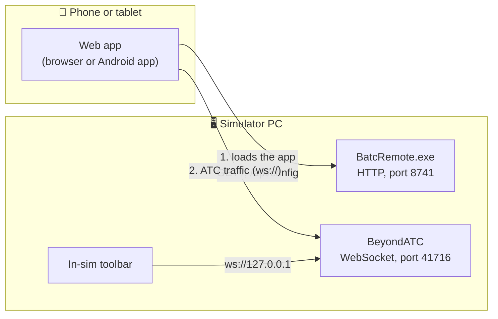
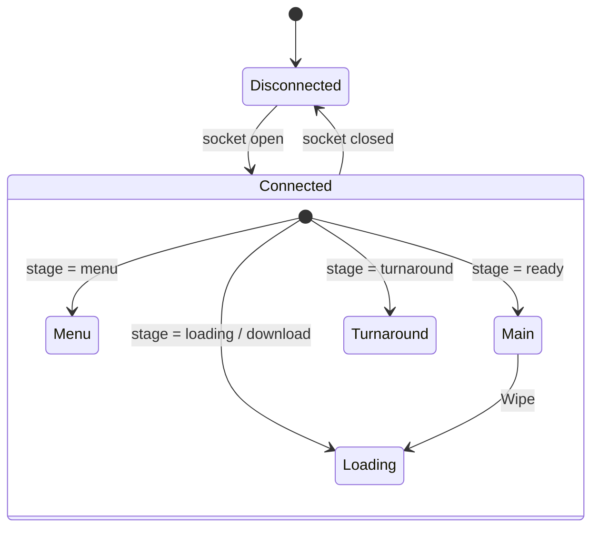

# BATC Remote — Technical guide

**English** · [Français](TECHNICAL-FR.md)

This guide explains how BATC Remote works: its architecture, the parts that make it up, the BeyondATC protocol it speaks, and how it is built and tested. For installation and everyday use, see the [README](../README.md).

> [!NOTE]
> BATC Remote is an independent community tool. It is unsupported and is not an official BeyondATC tool.
> The protocol described below is **not an official specification**. It was worked out from the BeyondATC toolbar (v3.1) and a recorded 36-minute IFR flight, and may change with any BeyondATC update.

## Contents

1. [Architecture](#1-architecture)
2. [Web app](#2-web-app)
3. [BatcRemote.exe (Windows host)](#3-batcremoteexe-windows-host)
4. [Android app](#4-android-app)
5. [BeyondATC protocol](#5-beyondatc-protocol)
6. [Client behaviour and timing rules](#6-client-behaviour-and-timing-rules)
7. [Testing and tools](#7-testing-and-tools)
8. [Limits and security](#8-limits-and-security)
9. [When BeyondATC changes its protocol](#9-when-beyondatc-changes-its-protocol)

---

## 1. Architecture

BeyondATC exposes a WebSocket server on port **41716**: that is how its in-sim toolbar talks to it. BATC Remote is simply one more client of that server, running on a phone or tablet. Nothing is changed in BeyondATC or MSFS, and no MSFS add-on is needed. The official toolbar can stay open at the same time.



| Component | Runs on | Technology | Role |
| --- | --- | --- | --- |
| Web app | Phone / tablet | TypeScript, Preact, Vite | The whole user interface and all protocol logic |
| BatcRemote.exe | Simulator PC | .NET 8, ASP.NET Core (Kestrel), WinForms | Serves the web app over HTTP; tray icon with QR code and BeyondATC status |
| Android app | Phone / tablet | Capacitor 8 | The same web app, packaged as an APK |
| BeyondATC | Simulator PC | (unchanged) | WebSocket server, as used by the toolbar |

`BatcRemote.exe` never relays, reads or changes the ATC traffic: the phone talks to BeyondATC directly.

### Finding BeyondATC

By default the user never types an address: the web app connects to port 41716 on the PC that served the page. When BeyondATC runs on another PC or port, the address is resolved in this order (`src/web/src/core/host.ts`):

1. `?host=IP:port` in the page URL (for tests);
2. the phone's own setting (*Settings → Connection*);
3. the PC's setting, read from `GET /api/config` (tray icon → *Settings…*);
4. the PC that served the page, port 41716.

The Android app has no "page host" (the page is packaged in the APK), so it relies on steps 2 and 3: the user scans the QR code shown by `BatcRemote.exe` once, or types the IP address.

---

## 2. Web app

`src/web/` — TypeScript (strict mode), Preact with `@preact/signals`, bundled by Vite. The production build is about 80 KB of JavaScript (under 30 KB gzipped), with no runtime dependency besides Preact.

The code is split into layers, so that only one module ever sees the raw protocol:

| Layer | Files | Responsibility |
| --- | --- | --- |
| Protocol | `protocol/types.ts`, `parser.ts`, `commands.ts` | Turns each frame into a typed message and never throws (bad JSON becomes an "invalid" message). Builds command strings. |
| Connection | `core/connection.ts`, `core/host.ts` | WebSocket lifecycle (see §6); address resolution and validation of the IP and port typed by the user. |
| State | `core/store.ts`, `core/controller.ts` | One signal per area (radios, actions, log, frequencies, settings…), so a `Progress` update every 5 s only redraws the progress bar. |
| Notifications | `core/notify.ts` | Decides when to chime and synthesises the chime with the Web Audio API (no audio file). |
| Platform | `core/platform.ts`, `core/scanner.ts`, `core/screen.ts` | Browser or Android app; QR scan of the PC and reading `/api/config`; screen kept on and dimmed (Android app). Only these files know about Capacitor. |
| UI | `ui/*.tsx`, `styles.css`, `i18n.ts` | Screens, panels and dialogs. All user-facing texts live in `i18n.ts` (English). |

Layout: phone in portrait (three tabs at the bottom: Actions, Log, Frequencies), tablet in landscape (log on the left, actions or frequencies on the right). Dark cockpit theme, touch targets of at least 44 px (52 px for action buttons), and the system's *reduce motion* setting is respected.

### Notification chime

A short two-tone chime plays when ATC addresses the user's aircraft (`ATC:` messages, and optionally `CPDLC_ATC:`). It stays silent for traffic calls, the user's own read-backs, and during the first 1.5 s after connecting (while the history is replayed). At most one chime every 1.5 s.

---

## 3. BatcRemote.exe (Windows host)

`src/host/BatcRemote.Host/` — a .NET 8 tray app in C#, published as a single file of about 0.8 MB with the web app embedded.

- **Web server:** ASP.NET Core minimal hosting (Kestrel) on port 8741, all network interfaces. The web app files are embedded in the exe (`ManifestEmbeddedFileProvider`), so there is no folder to copy. Hashed files under `/assets` are cached forever; `index.html` is always revalidated so updates are picked up. `--webroot <folder>` serves a folder instead (development).
- **Endpoints:**
  - `GET /api/config` gives phones the BeyondATC address and port chosen on the PC (with a CORS header, for the Android app);
  - `GET /api/status` returns the version and whether BeyondATC is reachable.
- **Tray icon:** the BATC Remote logo with a dot, green when BeyondATC answers on `127.0.0.1:41716`, orange otherwise (checked every 4 s).
  - Click: QR code of the PC's LAN address (QRCoder library), with a link to switch between network cards.
  - Right-click: copy the address, open the app on the PC, *Settings…*, *Launch at Windows startup* (per-user `HKCU\…\Run` key, no admin rights), Quit.
- **Settings window:** BeyondATC IP and port (phones pick them up at their next connection) and the web page port (restarts the app). Saved in `%AppData%\BATC Remote\settings.json`.
- **Safety:** single instance (named mutex); a clear message if port 8741 is already in use. `--port 8742` overrides the port for one launch.

---

## 4. Android app

`src/web/android/` — the same web app wrapped in a native shell with Capacitor 8. `npm run build` feeds both versions; `npx cap sync android` copies the build into the Android project, and Gradle produces the APK (about 6 MB).

- **Identifier** `io.github.proxi64.batcremote`, Android 7.0 (API 24) and newer.
- **Local network access:** the page is served inside the app as `http://localhost` and cleartext traffic is allowed, so the plain `ws://` connection to BeyondATC works as in the browser.
- **QR scan:** a small in-app plugin (`QrScannerPlugin.java`) uses the Google Play services code scanner. The camera screen runs inside Play services, so the app needs **no camera permission** and ships no image-recognition model. `/api/config` is then read with Capacitor's native HTTP client.
- **Text size:** Android's system font size is ignored (`setTextZoom(100)` in `MainActivity.java`); only the app's own *Text size* setting applies.
- **Screen during a flight** (`ScreenPlugin.java`, `core/screen.ts`): while connected to a flight (not on the BeyondATC menu), the screen is kept on (`FLAG_KEEP_SCREEN_ON`). After 30 s without touch, the app's window drops to minimum brightness; a touch (which then only wakes the screen and does not press the button under the finger), an `ATC:` or `CPDLC_ATC:` message, a BeyondATC question or error brings the system brightness back. Optionally, picking up or moving the phone does too: while dimmed only, the accelerometer is read (about 50 times per second) and a tilt change or a sustained movement wakes the screen; a *Motion sensitivity* slider from 1 to 10 sets the thresholds (tilt from 35° down to 8°, movement from 3.0 down to 0.6 m/s² averaged over about 120 ms, so brief desk vibrations are ignored). These settings are in *Settings → Display*, apply to the app's own window only and need no permission. When the flight ends or the app loses the connection, the phone behaves as usual again.
- **Look:** BATC Remote icon and splash screen (sources in `src/web/resources/`), light status-bar icons on the dark theme.

---

## 5. BeyondATC protocol

A text WebSocket on `ws://<PC>:41716`, with no sub-protocol and no authentication.

- **BeyondATC → client:** `Prefix: payload`, where the payload is plain text or JSON. The space after the colon may be missing.
- **Client → BeyondATC:** `command: argument` (colon **followed by a space**), except `prompt_reply`, which has no space.
- Each WebSocket frame carries exactly one message.

### 5.1 Messages received

**ATC log**

| Prefix | Payload | Meaning |
| --- | --- | --- |
| `ATC:` | text | ATC speaking to you |
| `ATCTraffic:` | text | ATC speaking to another aircraft |
| `Player:` | text | You (or your co-pilot) |
| `Traffic:` | text | Another aircraft |
| `CPDLC_ATC:` / `CPDLC_Pilot:` | text | CPDLC messages, from ATC / from you |

**Radios and flight**

| Prefix | Payload | Meaning |
| --- | --- | --- |
| `Facility:` | `Name\|Frequency`, or `Radio Off`, `Nothing Tuned`, `No Station Tuned` | COM1 station. May be repeated identically: de-duplicate. |
| `Com2:` | `{"label","frequency","monitor"}`, empty = hide | COM2. Without a station, `label` holds the frequency. `monitor` = listen only. |
| `RadioMute:` | `{"com1":bool,"com2":bool}` | Muted radios |
| `Callsign:` | `{"full","shortForm"}`, empty = hide | Callsign |
| `InfoBoxes:` | `[{"title","info"}]` | Clearance boxes. Replaces the whole list each time. Free titles (`Taxi to Runway`, `SID`, `Altitude Clearance`, `Squawk`…, casing varies). `info` may contain `<br>`. |
| `Progress:` | `{"from","to","pct"}` | Flight progress, about every 5 s in flight (`pct` with one decimal) |
| `CPDLCCode:` | text | CPDLC logon code |
| `AutoTune:` / `AutoRespond:` | `true` / `false` | Co-pilot options |

**Actions and exchange state**

| Prefix | Payload | Meaning |
| --- | --- | --- |
| `Actions:` | `[A¬B¬C¬]` | Requests the pilot can make. Separator `¬` (U+00AC), with `,` as fallback. The list ends with a separator: drop the empty last item. Labels can be dynamic (`FL120`, `Affirm`, `Say Again`…). |
| `CommsState:` | `{"mode","text"}` | Radio state. `mode` is `ready`, `queued`, `awaiting`, `speaking`, `request` (text = the request in progress), `processing` or `traffic` (`ATIS Generating`, `ATC Transmitting`, `Traffic Transmitting`…). Anything other than `ready` / `traffic` means busy: hide the actions. |
| `QueuedAction:` | text | Lags one action behind (see §6). Ignored. |
| `HideActions:` | — | Legacy, replaced by `CommsState`. |

**Frequencies and D-ATIS**

| Prefix | Payload | Meaning |
| --- | --- | --- |
| `Frequencies:` | JSON array (see 5.3) | Only sent in reply to `frequencies`. A trailing `,]` may appear. |
| `DATIS:` | `ICAO\|Letter\|Text` | One per airport, accumulated… |
| `DATIS_END:` | — | …until this marker, which replaces the whole D-ATIS set. |

**App lifecycle and dialogs**

| Prefix | Payload | Meaning |
| --- | --- | --- |
| `LoadState:` | `{"stage","text","pct","vfr","loggedIn"}` | `stage`: `menu`, `loading`, `download`, `ready`, `turnaround`. `pct = -1` means indeterminate. |
| `Wipe:` | — | New flight: clear everything, show "Loading flight…" |
| `Prompt:` | `{"id","title","text","yesLabel","noLabel"}`, empty = close | Yes/No question from BeyondATC |
| `AppError:` | `{"fatal","text"}`, empty = clear | Error (fatal) or warning, to acknowledge |
| `Settings:` | JSON (see 5.4) | Current BeyondATC settings |
| `ToolbarVersion:` | e.g. `3.1` | Protocol version expected by BeyondATC |
| `Pong:` | — | Reply to `ping`, sent only to the client that pinged |
| `Donut:` | — | Easter egg, ignored |

### 5.2 Commands sent

| Command | Effect |
| --- | --- |
| `atc_log` | Replay the full ATC log |
| `frequencies` | Request the frequency list |
| `datis` | Request the D-ATIS (`DATIS:` × n, then `DATIS_END:`) |
| `settings` | Request the settings |
| `ping` | Keep-alive (answered by `Pong:`) |
| `set_action: <label>` | **Say the request to ATC**, using the exact label received in `Actions` |
| `set_frequency: 118.700` | Tune COM1 |
| `set_frequency_com2: 118.700` | Tune COM2 |
| `set_autotune: true\|false` | Co-pilot tunes the radio |
| `set_autorespond: true\|false` | Co-pilot answers ATC |
| `set_setting: {"key":"…","value":…}` | Change one setting |
| `play_sample: autoRespond\|controller\|traffic` | Play a voice sample |
| `start_flight: IFR\|VFR_SIMBRIEF\|VFR_MSFS` | Start a flight from the main menu |
| `prompt_reply:<id>:yes\|no` | Answer a `Prompt:` (no space after the colon) |
| `ack_error` | Acknowledge an `AppError` |
| `quit_to_menu` | Quit the flight, back to the BeyondATC menu |
| `turnaround` | Start a turnaround flight (when `stage = turnaround`) |

There is no push-to-talk or microphone command: voice recognition stays in the BeyondATC desktop app. A remote client talks to ATC by choosing one of the proposed requests.

### 5.3 `Frequencies` item

```jsonc
{
  "type": "Tower",           // ATIS | AWOS | UNICOM | Information | Radio | FlightService | Clearance | Ground
                             // | Tower | ApproachDeparture | Approach | Departure | Center | VFR | None
  "airport": "LFBO",         // empty for Center
  "airportName": "Toulouse Blagnac",
  "name": "BLAGNAC TOWER",
  "frequency": "118.100",
  "cpdlcLogonCode": "LFBB",  // optional → CPDLC badge
  "runways": "14L 14R",      // optional, space-separated, often ""
  "stationType": "ASOS"      // for AWOS: ASOS | AWS (AWIS) | AWI (AWIB) | other (AWOS)
}
```

Grouping, as in the toolbar: items are grouped by airport, then by type, without duplicate frequencies. `Center` and `VFR` are listed apart, after the airports. A `None` item creates the airport without adding a frequency. Type order: ATIS, AWOS, UNICOM, Information, Radio, FlightService (FSS), Clearance, Ground, Tower, ApproachDeparture (TRACON), Approach, Departure. The airport's D-ATIS text is shown under its ATIS group.

### 5.4 `Settings`

| Key | Type | Setting |
| --- | --- | --- |
| `simIs2024`, `taxiArrowsShown` | bool | Taxi arrows (MSFS 2024 only) |
| `voiceVolume` | 0–100 | Voice volume |
| `uiSounds` | bool | UI sounds |
| `dynamicVoiceOn` | bool (missing = hide) | Dynamic auto-respond voice |
| `dynamicVoiceGender` + `voiceGenderOptions` | list (`"0"`, `"1"`, `"2"`) | Dynamic voice gender |
| `autoRespondVoice` + `autoRespondVoiceOptions` | index in a list of names | Manual auto-respond voice |
| `controllerVoice`, `trafficVoice` + `voiceQualityOptions` | `Off` / `Local` / `Premium` | Voice quality |
| `premiumUnits` / `premiumUnitsMax` | int | Premium characters left (read-only) |
| `trafficOn` | bool | AI traffic |
| `parkedDensity`, `departuresDensity`, `arrivalsDensity`, `enrouteDensity` | 0–10 | Traffic density |
| `navigraphLiveTraffic` | bool | Navigraph live traffic (locked unless `navigraphLinked && navigraphUltimate`) |

Changing a setting: `set_setting: {"key":"voiceVolume","value":80}`. Sliders only send their value when released, so as not to flood BeyondATC.

### 5.5 Screen state machine



- **Menu:** *Start a flight* (IFR SimBrief, VFR SimBrief, VFR MSFS map); "log into BeyondATC" message if `loggedIn = false`.
- **Loading:** text and progress bar (when `pct ≥ 0`).
- **Main:** top panel (radios, callsign, progress, clearance boxes), Actions, Log, Frequencies.
- **Turnaround:** main screen with a turnaround banner and button.
- **Overlays at any time:** `AppError`, `Prompt`, the local "Quit to main menu" confirmation, Settings.

### 5.6 Feature → protocol map

| Feature | Received | Sent |
| --- | --- | --- |
| Talk to ATC | `Actions`, `CommsState` | `set_action` |
| ATC log | `ATC`, `ATCTraffic`, `Player`, `Traffic`, `CPDLC_*` | `atc_log` |
| COM1 / COM2 | `Facility`, `Com2`, `RadioMute` | `set_frequency`, `set_frequency_com2` |
| Frequencies and D-ATIS | `Frequencies`, `DATIS`, `DATIS_END`, `Progress` | `frequencies`, `datis` |
| Flight info | `InfoBoxes`, `Callsign` | — |
| Co-pilot | `AutoRespond`, `AutoTune` | `set_autorespond`, `set_autotune` |
| Start / quit / turnaround | `LoadState`, `Wipe` | `start_flight`, `quit_to_menu`, `turnaround` |
| Dialogs | `Prompt`, `AppError` | `prompt_reply`, `ack_error` |
| Settings | `Settings` | `settings`, `set_setting`, `play_sample` |
| Connection health | `Pong`, `ToolbarVersion` | `ping` |

---

## 6. Client behaviour and timing rules

All of these were observed on a real flight and are covered by tests.

**Connection** (`core/connection.ts`)
- Reconnect with back-off: 1, 2, 4, 8, then 15 s, plus up to 300 ms of random jitter.
- Opening times out after 8 s.
- `ping` every 15 s; the connection is restarted if nothing arrives for 45 s.
- Re-check as soon as the phone wakes up.
- Events from old sockets are ignored.
- On connect, the client sends `atc_log`, `settings`, `frequencies` and `datis`. It never sends anything the user did not trigger.

**Snapshot.** Whenever *any* client connects, BeyondATC sends a full state snapshot (`Facility`, `CPDLCCode`, `AutoTune`, `AutoRespond`, `Actions`, D-ATIS, `InfoBoxes`, `Com2`, `RadioMute`, `CommsState`, `LoadState`, `Callsign`, `ToolbarVersion`, `Settings`) to *all* clients. The client must apply it idempotently. A reconnecting client gets the whole state back without asking.

**Several clients.** Every message is broadcast to every client (except `Pong:`), so the in-sim toolbar and one or more phones can run together. Actions sent by one client are not echoed to the others: only their effects are visible (`CommsState`, then `Player:`, then `ATC:`).

**`Actions` bursts.** After each exchange, BeyondATC sends the old list, then `[]`, then the new list, within 2 ms. The store keeps only the last list received within **200 ms**, so the buttons don't flicker.

**Short `ready` states.** A typical exchange lasts 20–30 s and passes through `queued`, `awaiting`, `speaking`, `request`… with brief returns to `ready` (20–30 ms) between steps. Actions are hidden as soon as the state is busy, and shown again only after **250 ms** of `ready`.

**Sent action.** When the user taps an action, it is marked as sent until BeyondATC reacts, or for 6 s at most. This prevents double sends.

**`QueuedAction` lag.** `QueuedAction` and the `queued` text lag one action behind (tapping *Request Taxi to Runway* gives `QueuedAction: Request IFR Clearance`). The client ignores them and shows the text of the `request` mode instead.

**Lost connection.** When BeyondATC closes, the socket closes (1005), then connections are refused (1006). The app shows a "Reconnecting…" banner, then after 6 s a full screen with a checklist (BeyondATC running, same Wi-Fi, firewall).

**The toolbar is not required.** With the toolbar package disabled in MSFS, BeyondATC still listens on `0.0.0.0:41716`, sends the snapshot and answers `ping`.

---

## 7. Testing and tools

The protocol and state logic are tested against a **real recorded flight** (`src/web/tests/fixtures/capture-2026-09-23.jsonl`, LFBZ → LFBO, 940 messages) rather than hand-made samples. `npm test` runs 63 tests (Vitest):

| Area | What is checked |
| --- | --- |
| Parser | All 940 messages parse with no unknown or invalid result; edge cases (trailing `¬`, empty payloads, colons inside ATC text, `\|` inside D-ATIS, trailing comma in `Frequencies`). |
| State | The whole flight replayed with its real timings; final state checked (station, callsign, clearances, D-ATIS, 12 ATC messages); `Actions` bursts, short `ready` states, `Wipe`. |
| Connection | Back-off delays, open timeout, ping and silent-connection restart, stale sockets, address priority order. |
| Notifications | Which messages ring, options, quiet period, bursts. The recorded flight gives exactly one chime per ATC call to the aircraft (12). |
| Screen | Kept on during a flight, dimmed after 30 s, woken by a touch (swallowed when dimmed), an ATC call or a motion of the phone; motion sensors read only while dimmed; normal behaviour restored after the flight; settings switched off or changed. |
| QR scan | Reading the PC address, rejecting unrelated QR codes, turning `/api/config` into the BeyondATC address, unreachable PC. |

**BeyondATC simulator** (`npm run sim`, `src/web/dev/batc-simulator.mjs`): a Node.js WebSocket server on port 41716 that replays the capture and imitates BeyondATC (snapshot to every client, `Pong` to the sender only, a scripted exchange on `set_action`). Type `prompt`, `error`, `warning`, `menu`, `loading`, `turnaround`… in its console to trigger the other screens. It allows development without MSFS. Close the real BeyondATC first.

**Sniffer** (`Tools/batc-sniffer.html`): a single HTML page that records every frame with millisecond timestamps, counts prefixes, shows JSON structures, can open two simultaneous clients, and exports `.txt` / `.jsonl`.

**Build** (`build.ps1`, needs Node.js 22+ and the .NET 8 SDK): type checking and tests, web build into the host's `wwwroot`, then a single-file `BatcRemote.exe` (Windows x64) in `dist\`. When the Android SDK is installed, it also builds the Android app: the signed `BatcRemote.apk` when `src/web/android/keystore.properties` points to a signing key (see `keystore.properties.example`; the key and its passwords are never committed), otherwise `BatcRemote-debug.apk`, for testing only.

---

## 8. Limits and security

**Plain HTTP on a local network.** Browsers reserve some features for HTTPS pages:
- the browser version cannot keep the screen awake (Screen Wake Lock API): set a longer screen timeout during the flight, or use the Android app, which does it;
- the home-screen shortcut opens a browser tab rather than a standalone app (the in-app *Fullscreen* button hides the browser bars);
- sound only plays after a first tap, and not while the screen is locked or the browser is in the background.

An HTTPS page could not use this setup at all, because a secure page is not allowed to open a plain `ws://` connection to a LAN address.

**Firewall.** Windows Firewall must allow port 8741 (BatcRemote.exe) and 41716 (BeyondATC) on *private* networks.

**Security.** BeyondATC's port 41716 accepts connections from any device on the local network, with no authentication. Anyone on the same Wi-Fi who knows the protocol could send commands (for example `quit_to_menu`). This is how BeyondATC works today; BATC Remote does not open anything new. On a home network the risk is low; avoid running it on public or shared networks.

---

## 9. When BeyondATC changes its protocol

The protocol is internal to BeyondATC and can change with any version. BATC Remote is designed to notice rather than break:

- unknown prefixes are ignored and listed in *Settings → About*;
- `ToolbarVersion:` is compared with the version the app was written for (3.1), and a warning is shown if they differ;
- missing spaces after colons and empty JSON payloads are tolerated.

To adapt to a new version:

1. record a flight with `Tools/batc-sniffer.html`;
2. save the `.jsonl` export into `src/web/tests/fixtures/`;
3. run `npm test` and fix the parser (`src/web/src/protocol/`) until everything parses again.
