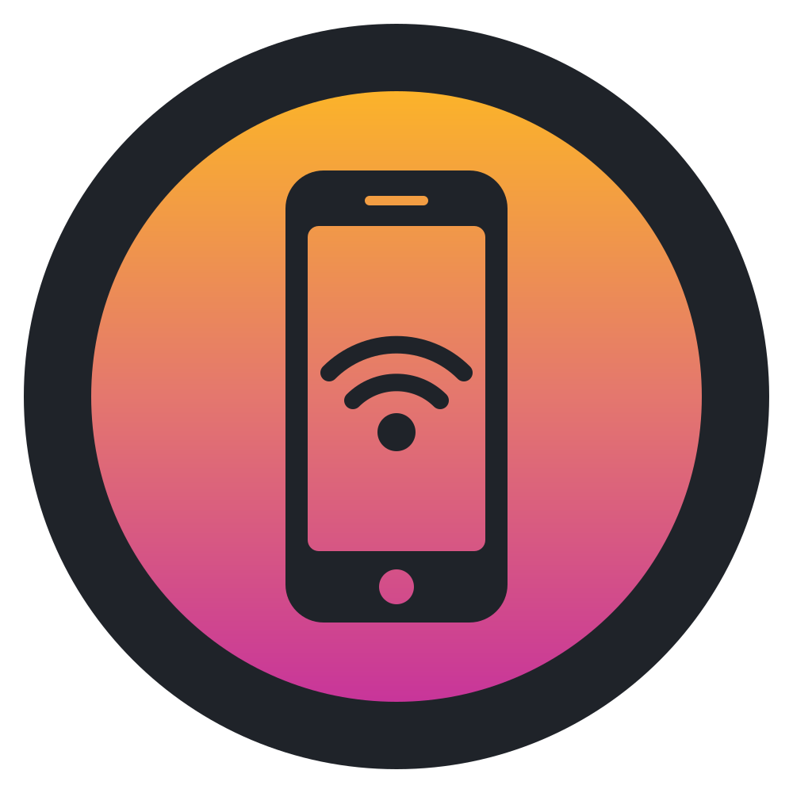
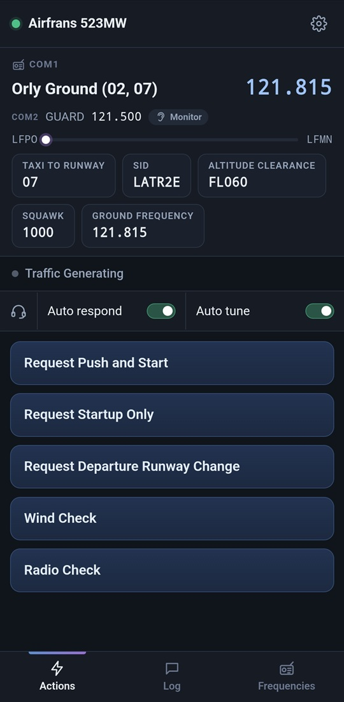
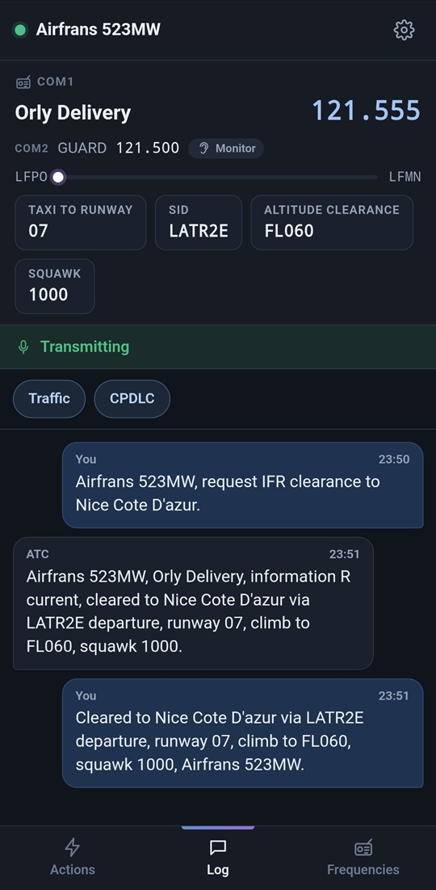
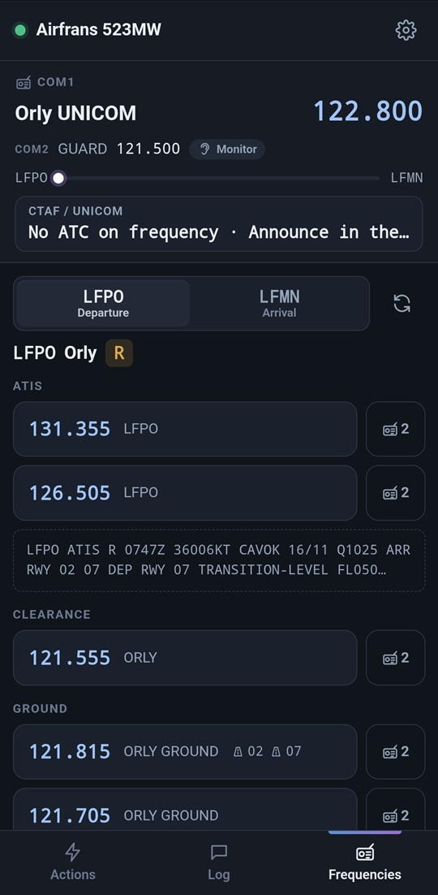
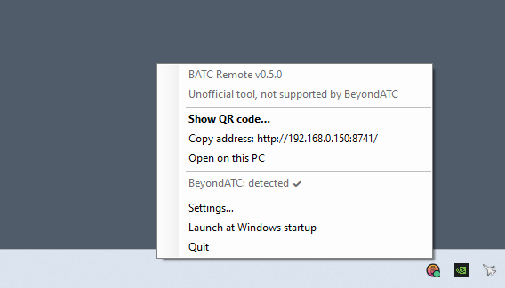
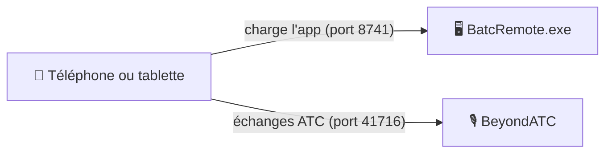

<div align="center">



# BATC Remote

**Votre toolbar BeyondATC, dans votre main.**

Parlez à l'ATC, consultez vos clairances et réglez vos fréquences dans Microsoft Flight Simulator 2024 depuis votre téléphone ou votre tablette Android, en Wi-Fi.

[English](README.md) · **Français**


</div>

> [!IMPORTANT]
> **BATC Remote est un outil communautaire indépendant.** Il n'est **pas supporté** et **n'est pas un outil officiel BeyondATC**.
> Merci de **ne pas contacter le support de BeyondATC** à son sujet. Utilisez plutôt les [Issues](../../issues) de ce dépôt.
> Publié avec l'autorisation de BeyondATC. BeyondATC et Microsoft Flight Simulator sont des marques de leurs propriétaires respectifs.

---

## ✈️ Pourquoi BATC Remote ?

BeyondATC donne vie au contrôle aérien dans MSFS 2024. Mais aller chercher la toolbar dans le simulateur en pleine approche, c'est quitter la vue cockpit, retrouver la fenêtre et cliquer sur de petits boutons.

BATC Remote met cette même toolbar sur le téléphone ou la tablette posé à côté de votre manche : de gros boutons faciles à toucher, vos clairances toujours sous les yeux, et un petit carillon quand l'ATC vous appelle. La toolbar du simulateur continue de fonctionner en même temps : vous utilisez celle qui est la plus proche.

## ✨ Points forts

- 🎙️ **Toutes vos demandes ATC, à portée de doigt.** De gros boutons pour chaque demande que BeyondATC propose à ce moment-là.
- 🧾 **Votre clairance d'un coup d'œil.** Piste de roulage, SID, altitude, transpondeur et plus, toujours visibles en haut de l'écran avec COM1/COM2 et la progression du vol.
- 📻 **Des fréquences simples à régler.** Classées par aéroport et par type, avec le D-ATIS. Un toucher règle COM1, le bouton latéral règle COM2.
- 💬 **Un journal radio lisible.** Chaque échange affiché comme une conversation, avec des filtres Traffic et CPDLC.
- 🔔 **Ne manquez plus un appel.** Un carillon, en option, quand l'ATC s'adresse à *votre* avion, et pas aux autres.
- 🧑‍✈️ **Les commandes du copilote.** Les interrupteurs *Auto respond* et *Auto tune* toujours à portée.
- ⚙️ **Tous les réglages de BeyondATC.** Voix, volume, trafic IA et plus.
- 📱 **Deux façons de l'utiliser.** Dans le navigateur du téléphone, sans rien installer, ou avec l'app Android, qui se connecte en scannant un QR code.
- 🔆 **Un écran qui vous suit.** Dans l'app Android, l'écran reste allumé pendant le vol et s'assombrit après 30 secondes ; un toucher, un appel de l'ATC ou le fait de reprendre le téléphone en main le rallume.
- 🔌 **Léger et sans risque.** Rien n'est modifié dans MSFS ni dans BeyondATC : le téléphone parle à BeyondATC exactement comme sa propre toolbar.

<p align="center">
  
  
  
</p>

## 🚀 Pour commencer

### Ce qu'il vous faut
- Un PC Windows avec **MSFS 2024** et **BeyondATC**.
- Les runtimes **ASP.NET Core 8** et **Windows Desktop 8** (ou plus récents) sur ce PC. Ils sont gratuits chez Microsoft, et déjà présents si le SDK .NET est installé.
- Un **téléphone ou une tablette Android** (Android 7 ou plus récent) sur le **même réseau Wi-Fi** que le PC.

Téléchargez `BatcRemote.exe` et `BatcRemote.apk` depuis la dernière version publiée sur la page [Releases](../../releases), ou compilez-les vous-même (voir *Compiler depuis les sources*, plus bas).

### Option A : dans le navigateur du téléphone (rien à installer)

1. Lancez BeyondATC comme d'habitude.
2. Lancez **`BatcRemote.exe`** sur le PC. C'est un fichier unique, à placer où vous voulez. Une petite icône apparaît près de l'horloge.
   La première fois, Windows demande l'accès au réseau : cochez **Réseaux privés**.
3. Cliquez sur l'icône pour afficher un **QR code**, et scannez-le avec l'appareil photo du téléphone.
4. Dans le menu du navigateur, choisissez **Ajouter à l'écran d'accueil**. La prochaine fois, il suffira de toucher l'icône.

Laissez `BatcRemote.exe` tourner pendant le vol. Il ne consomme presque rien et sert la page chaque fois que le téléphone la recharge.

### Option B : l'app Android

1. Copiez `BatcRemote.apk` sur le téléphone et ouvrez-le. Autorisez l'installation d'applications depuis cette source quand Android le demande.
   Si une version de test (`BatcRemote-debug.apk`) est déjà installée, désinstallez-la d'abord : Android refuse de remplacer une app signée avec une autre clé.
2. Au premier lancement, touchez **Scan the QR code** et scannez le code affiché par `BatcRemote.exe`.
   Aucune autorisation d'accès à l'appareil photo n'est nécessaire : le scanner est fourni par les services Google Play.
   Pas de `BatcRemote.exe` ? Saisissez à la place l'**adresse IP du PC** où tourne BeyondATC.
3. C'est tout. Vous pourrez changer l'adresse plus tard dans *Settings → Connection*.

L'app s'affiche en plein écran, sans barre de navigateur, et utilise son propre réglage de taille de texte, quelle que soit la taille de police d'Android. Pendant le vol, elle garde l'écran allumé, avec une luminosité au minimum après 30 secondes sans toucher l'écran ; un toucher, un appel de l'ATC ou le fait de reprendre le téléphone en main rétablit la luminosité normale, avec une sensibilité aux mouvements réglable (*Settings → Display*). Après le premier scan, `BatcRemote.exe` n'est plus nécessaire.

> L'interface de l'application est en anglais : les noms d'écrans et de boutons sont donc donnés en anglais dans ce document.

## 🗺️ Petit tour de l'app

| Écran | Ce que vous y trouvez |
| --- | --- |
| **Bandeau du haut** | COM1/COM2, la progression du vol et vos cases de clairance (piste de roulage, SID, altitude, transpondeur…). |
| **Actions** | De gros boutons pour les demandes ATC disponibles à cet instant. Ils sont grisés pendant une transmission. La barre **Co-pilot** (*Auto respond*, *Auto tune*) reste en haut quand vous faites défiler. |
| **Log** | Chaque échange sous forme de conversation, avec des filtres Traffic et CPDLC. |
| **Frequencies** | Les fréquences de départ et d'arrivée par type, avec le D-ATIS (touchez-le pour le lire en entier). Un toucher règle COM1, le bouton latéral règle COM2. |
| **Settings** | Tous les réglages de BeyondATC, plus la taille du texte, la vibration, le carillon de notification, la connexion et, dans l'app Android, l'écran (toujours allumé, assombrissement, réveil par mouvement et sa sensibilité). |

BATC Remote suit aussi BeyondATC à chaque étape du vol : le menu *Start a flight*, le chargement, les questions et erreurs, la rotation (turnaround), et la reconnexion automatique si le Wi-Fi décroche.

## 🖥️ Le compagnon PC : BatcRemote.exe

`BatcRemote.exe` se loge dans la zone de notification, à côté de l'horloge :

- **Clic** sur l'icône : affiche le QR code.
- **Clic droit** : copier l'adresse, ouvrir l'app sur le PC, changer les réglages (**Settings…**), ou activer *Launch at Windows startup* (lancement au démarrage de Windows).
- La **pastille** sur l'icône indique si BeyondATC tourne : 🟢 détecté, 🟠 non lancé.

<p align="center"></p>

Comment tout s'articule :



Le téléphone charge l'app depuis `BatcRemote.exe`, puis parle **directement** à BeyondATC. `BatcRemote.exe` ne relaie jamais les échanges ATC.

<details>
<summary><b>Changer l'adresse ou le port de BeyondATC</b></summary>

Par défaut, il n'y a rien à configurer : le téléphone se connecte à BeyondATC sur le PC qui a servi l'app, port 41716. Pour utiliser un autre PC ou un autre port, du plus prioritaire au moins prioritaire :

| Où | Quoi | S'applique à |
| --- | --- | --- |
| Adresse `?host=192.168.1.30:41716` | IP et port | cette ouverture de page seulement (tests) |
| App → *Settings → Connection* | un seul champ **IP : port** (vide = automatique) | ce téléphone seulement |
| Icône → **Settings…** | IP et port de BeyondATC, port de la page web | tous les téléphones, à leur prochaine connexion |

Les réglages du PC sont enregistrés dans `%AppData%\BATC Remote\settings.json`. Changer le port de la page web redémarre BATC Remote (scannez ensuite le nouveau QR code). `BatcRemote.exe --port 8742` impose le port pour un seul lancement.
</details>

## 💡 Bon à savoir

- **Le carillon** ne sonne qu'après un premier toucher dans l'app (une règle des navigateurs). Il reste muet pour les appels au trafic et pour l'historique rejoué à la reconnexion. Il ne peut pas encore sonner quand l'écran est verrouillé ou que le navigateur est en arrière-plan.
- **Garder l'écran allumé :** l'app Android le fait pendant le vol (voir plus haut). Une page web servie en simple HTTP ne le peut pas : avec la version navigateur, réglez *Paramètres Android → Affichage → Mise en veille de l'écran* sur 10 minutes, ou utilisez *Options pour les développeurs → Rester activé* (pendant la charge).
- **Plein écran :** la version navigateur a un bouton **Fullscreen** dans la barre du haut. L'app Android est toujours en plein écran.
- **Langue :** l'app est en anglais.

<details>
<summary><b>Dépannage</b></summary>

- **Le téléphone n'arrive pas à ouvrir la page :** vérifiez que le téléphone et le PC sont sur le même réseau Wi-Fi, et que Windows a autorisé `BatcRemote.exe` sur les *Réseaux privés* (pare-feu Windows).
- **La page s'ouvre mais ne se connecte jamais :** vérifiez que BeyondATC est lancé (pastille verte sur l'icône).
- **Plusieurs cartes réseau sur le PC (Ethernet, Wi-Fi, VPN…) :** la fenêtre du QR code a un lien *Other network address* pour passer de l'une à l'autre.
</details>

## 🛣️ Feuille de route

- Faire sonner le carillon et rallumer l'écran téléphone verrouillé (app Android).
- Des améliorations de mise en page pour les tablettes et les grandes tailles de texte.

Idées et signalements de bugs sont les bienvenus dans les [Issues](../../issues).

## 🛠️ Compiler depuis les sources

> **Débutant ?** Le **[guide de compilation pas à pas](https://proxi64.github.io/BATC-Remote/Documentation/Build-Guide-FR.html)** liste tous les outils à installer et toutes les commandes à taper.

Prérequis : **Node.js 22+** et le **SDK .NET 8** (ou plus récent). Ajoutez **Android Studio** pour compiler l'app Android.

```powershell
# Tout d'un coup : tests, app web, BatcRemote.exe (et l'APK si le SDK Android est trouvé), dans dist\
.\build.ps1
```

<details>
<summary><b>Signer l'app Android</b></summary>

Sans clé de signature, `build.ps1` ne produit que `dist\BatcRemote-debug.apk`, une version de test. Pour obtenir le `dist\BatcRemote.apk` signé :

1. Créez une fois votre propre clé, **en dehors du dépôt** (`keytool` est fourni avec Android Studio) :
   ```powershell
   & "$env:ProgramFiles\Android\Android Studio\jbr\bin\keytool.exe" -genkeypair -v -keystore C:\Users\VotreNom\Keys\batc-remote-release.jks -alias batcremote -keyalg RSA -keysize 2048 -validity 10000
   ```
2. Copiez `src\web\android\keystore.properties.example` en `keystore.properties` dans le même dossier, et indiquez-y le chemin et les mots de passe.
3. Relancez `.\build.ps1`.

`keystore.properties` et la clé sont ignorés par Git : ne les commitez jamais. Gardez une sauvegarde de la clé et de ses mots de passe, car chaque mise à jour de l'app doit être signée avec la même clé.
</details>

<details>
<summary><b>Commandes de développement</b></summary>

```powershell
cd src\web
npm install
npm run dev                 # rechargement à chaud : http://localhost:5173 (depuis le téléphone : http://PC:5173)

# Simulateur BeyondATC : rejoue un vrai vol, pas besoin de MSFS
npm run sim                 # port 41716 : fermez d'abord le vrai BeyondATC
npm run sim -- --menu       # démarre sur le menu "Start a flight"
# puis tapez dans la fenêtre du simulateur : prompt | error | warning | menu | ready | loading | turnaround | pause | resume

npm test                    # tests unitaires, sur la capture d'un vrai vol

# Android
npm run android:sync        # compile l'app web et la copie dans le projet Android
npm run android:open        # l'ouvre dans Android Studio (Run ▶ l'installe sur un téléphone branché en USB)
npm run android:release     # APK signé (nécessite android\keystore.properties)
```
</details>

<details>
<summary><b>Organisation du projet</b></summary>

```
src/web/                       App web (TypeScript + Preact + Vite)
  src/protocol/                Protocole BeyondATC : types, parseur, commandes (le seul code qui connaît le format brut)
  src/core/                    Connexion, résolution d'adresse, état, préférences, regroupement des fréquences,
                               notifications, détection de plateforme, scan QR, écran toujours allumé (app Android)
  src/ui/                      Écrans, panneaux, dialogues
  src/i18n.ts                  Tous les textes affichés
  android/                     App Android (Capacitor) ; code natif dans app/src/main/java/io/github/proxi64/batcremote/
  resources/                   Sources de l'icône et de l'écran de démarrage Android
  tests/                       Tests Vitest + capture d'un vrai vol (LFBZ → LFBO)
  dev/batc-simulator.mjs       Simulateur BeyondATC
src/host/BatcRemote.Host/      App Windows .NET 8 (zone de notification) : sert l'app web intégrée, QR code, réglages,
                               état de BeyondATC, démarrage auto, /api/config et /api/status
Documentation/                 Guide technique (TECHNICAL.md), présentation technique (HTML), guide de compilation (Build-Guide-FR.html)
Tools/                         batc-sniffer.html (enregistreur de protocole), logo
```
</details>

### 📚 Guide technique

L'architecture, le protocole BeyondATC (messages, commandes, règles de temps), l'hôte Windows, l'app Android et les outils de test sont décrits dans le **[guide technique](Documentation/TECHNICAL-FR.md)**. Une **[présentation technique](https://proxi64.github.io/BATC-Remote/Documentation/BATC-Remote-Technical-Overview-FR.html)** plus courte et illustrée est aussi disponible.

## 📄 Licence

BATC Remote est distribué sous [licence MIT](LICENSE).

BeyondATC et Microsoft Flight Simulator sont des marques de leurs propriétaires respectifs. Ce projet est un outil communautaire indépendant, non officiel et non supporté.
