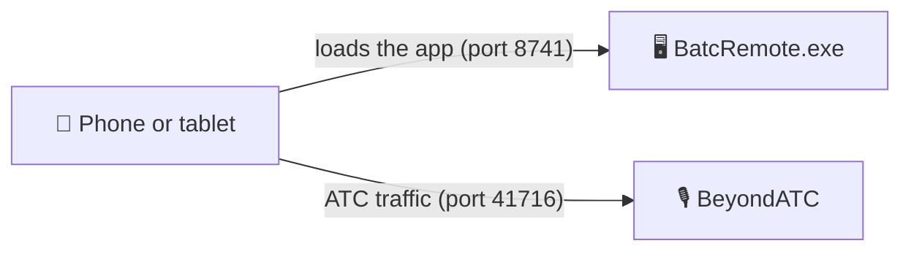

<div align="center">


# BATC Remote

**Your BeyondATC toolbar, in your hand.**

Talk to ATC, check your clearances and tune frequencies in Microsoft Flight Simulator 2024 from your Android phone or tablet, over Wi-Fi.

**English** · [Français](README-FR.md)


</div>

> [!IMPORTANT]
> **BATC Remote is an independent community tool.** It is **unsupported** and is **not an official BeyondATC tool**.
> Please **do not contact BeyondATC support** about it. Use this repository's [Issues](../../issues) instead.
> Published with BeyondATC's permission. BeyondATC and Microsoft Flight Simulator are trademarks of their respective owners.

---

## ✈️ Why BATC Remote?

BeyondATC is a great way to bring air traffic control to life in MSFS 2024. But reaching for the in-sim toolbar in the middle of a busy approach means leaving the cockpit view, finding the window, and clicking small buttons.

BATC Remote puts the same toolbar on the phone or tablet sitting next to your yoke: big buttons you can tap without looking twice, your clearances always in sight, and a gentle chime when ATC calls you. The in-sim toolbar keeps working at the same time, so you can use whichever is closer.

## ✨ Highlights

- 🎙️ **All your ATC requests, one tap away.** Large, easy-to-hit buttons for every request BeyondATC offers at that moment.
- 🧾 **Your clearance at a glance.** Taxi runway, SID, altitude, squawk and more, always visible at the top of the screen with COM1/COM2 and your flight progress.
- 📻 **Frequencies made simple.** Grouped by airport and type, with the D-ATIS. Tap to tune COM1, or use the side button for COM2.
- 💬 **A readable radio log.** Every exchange shown as a chat conversation, with Traffic and CPDLC filters.
- 🔔 **Never miss a call.** An optional chime when ATC addresses *your* aircraft, but not the other traffic.
- 🧑‍✈️ **Co-pilot controls.** *Auto respond* and *Auto tune* switches always within reach.
- ⚙️ **Every BeyondATC setting.** Voices, volume, AI traffic and more, from the couch or the cockpit.
- 📱 **Two ways to use it.** In the phone's browser with nothing to install, or as an Android app that connects by scanning a QR code.
- 🔆 **A screen that stays with you.** In the Android app, the screen stays on during the flight and dims after 30 seconds; a touch, an ATC call or picking up the phone brings it back.
- 🔌 **Light and safe.** Nothing is modified in MSFS or BeyondATC; the phone simply talks to BeyondATC the same way its own toolbar does.

<p align="center">
  
  
  
</p>

## 🚀 Getting started

### What you need
- A Windows PC running **MSFS 2024** and **BeyondATC**.
- The **ASP.NET Core 8** and **Windows Desktop 8** runtimes (or newer) on that PC. They are free from Microsoft, and already present if the .NET SDK is installed.
- An **Android phone or tablet** (Android 7 or newer) on the **same Wi-Fi network** as the PC.

Download `BatcRemote.exe` and `BatcRemote.apk` from the latest release on the [Releases](../../releases) page, or build them yourself (see *Building from source* below).

### Option A: in the phone's browser (nothing to install)

1. Start BeyondATC as usual.
2. Run **`BatcRemote.exe`** on the PC. It is a single file that you can put anywhere. A small icon appears near the clock.
   The first time, Windows asks about network access: tick **Private networks**.
3. Click the icon to show a **QR code**, and scan it with the phone's camera.
4. In the browser menu, choose **Add to Home screen**. Next time, just tap the icon.

Leave `BatcRemote.exe` running during the flight. It uses almost no resources and serves the page whenever the phone reloads it.

### Option B: the Android app

1. Copy `BatcRemote.apk` to the phone and open it. Allow installing apps from this source when Android asks.
   If a test version (`BatcRemote-debug.apk`) is already installed, uninstall it first: Android refuses to replace an app signed with another key.
2. On first launch, tap **Scan the QR code** and scan the code shown by `BatcRemote.exe`.
   No camera permission is needed: the scanner is provided by Google Play services.
   No `BatcRemote.exe`? Type the **IP address of the PC** running BeyondATC instead.
3. That's it. You can change the address later in *Settings → Connection*.

The app runs full screen, with no browser bar, and uses its own text size setting whatever the Android font size. During a flight it keeps the screen on, dimmed after 30 seconds without touch; a touch, an ATC call or picking up the phone brings the normal brightness back, with an adjustable motion sensitivity (*Settings → Display*). After the first scan, `BatcRemote.exe` is no longer needed.

## 🗺️ A quick tour

| Screen | What you'll find |
| --- | --- |
| **Top panel** | COM1/COM2, flight progress, and your clearance boxes (taxi runway, SID, altitude, squawk…). |
| **Actions** | Big buttons for the ATC requests available right now. They are greyed out while someone is talking. The **Co-pilot** bar (*Auto respond*, *Auto tune*) stays on top while you scroll. |
| **Log** | Every exchange as a chat conversation, with Traffic and CPDLC filters. |
| **Frequencies** | Departure and arrival frequencies by type, with the D-ATIS (tap to read it all). Tap to tune COM1, side button for COM2. |
| **Settings** | All BeyondATC settings, plus text size, vibration, notification chime, the connection and, in the Android app, the screen (kept on, dimming, wake on motion and its sensitivity). |

BATC Remote also follows BeyondATC through every stage of the flight: the *Start a flight* menu, loading, questions and errors, turnaround, and automatic reconnection if the Wi-Fi drops.

## 🖥️ The PC companion: BatcRemote.exe

`BatcRemote.exe` lives in the notification area, next to the clock:

- **Click** the icon to show the QR code.
- **Right-click** it to copy the address, open the app on the PC, change the **Settings…**, or turn on *Launch at Windows startup*.
- The **dot** on the icon tells you whether BeyondATC is running: 🟢 detected, 🟠 not started.

<p align="center"></p>

How it fits together:



The phone loads the app from `BatcRemote.exe`, then talks **directly** to BeyondATC. `BatcRemote.exe` never relays the ATC traffic.

<details>
<summary><b>Changing the BeyondATC address or port</b></summary>

Nothing needs to be configured by default: the phone connects to BeyondATC on the PC that served the app, port 41716. To use another PC or port, from highest to lowest priority:

| Where | What | Applies to |
| --- | --- | --- |
| Address `?host=192.168.1.30:41716` | IP and port | this page opening only (tests) |
| App → *Settings → Connection* | one **IP : port** field (empty = automatic) | this phone only |
| Tray icon → **Settings…** | BeyondATC IP and port, web page port | every phone, at its next connection |

The PC settings are saved in `%AppData%\BATC Remote\settings.json`. Changing the web page port restarts BATC Remote (scan the new QR code afterwards). `BatcRemote.exe --port 8742` forces the port for a single launch.
</details>

## 💡 Good to know

- **The chime** only plays after a first tap in the app (a browser rule). It is silent for traffic calls and for the history replayed when you reconnect. It cannot play while the screen is locked or the browser is in the background yet.
- **Keeping the screen on:** the Android app does it during a flight (see above). A web page served over plain HTTP cannot: in the browser version, set *Android Settings → Display → Screen timeout* to 10 minutes, or use *Developer options → Stay awake while charging*.
- **Full screen:** the browser version has a **Fullscreen** button in the top bar. The Android app is always full screen.
- **Language:** the app is in English.

<details>
<summary><b>Troubleshooting</b></summary>

- **The phone can't open the page:** check that the phone and the PC are on the same Wi-Fi network, and that Windows allowed `BatcRemote.exe` on *Private networks* (Windows Firewall).
- **The page opens but never connects:** check that BeyondATC is running (green dot on the tray icon).
- **Several network cards on the PC (Ethernet, Wi-Fi, VPN…):** the QR code window has an *Other network address* link to switch between them.
</details>

## 🛣️ Roadmap

- Play the chime and wake the screen while the phone is locked (Android app).
- Layout refinements for tablets and large text sizes.

Ideas and bug reports are welcome in the [Issues](../../issues).

## 🛠️ Building from source

> **New to this?** The **[step-by-step build guide](https://proxi64.github.io/BATC-Remote/Documentation/Build-Guide.html)** lists every tool to install and every command to type, for beginners.

Prerequisites: **Node.js 22+** and the **.NET 8 SDK** (or newer). Add **Android Studio** to build the Android app.

```powershell
# Everything at once: tests, web app, BatcRemote.exe (and the APK if the Android SDK is found), in dist\
.\build.ps1
```

<details>
<summary><b>Signing the Android app</b></summary>

Without a signing key, `build.ps1` only produces `dist\BatcRemote-debug.apk`, a test build. To build the signed `dist\BatcRemote.apk`:

1. Create your own key once, **outside the repository** (`keytool` comes with Android Studio):
   ```powershell
   & "$env:ProgramFiles\Android\Android Studio\jbr\bin\keytool.exe" -genkeypair -v -keystore C:\Users\YourName\Keys\batc-remote-release.jks -alias batcremote -keyalg RSA -keysize 2048 -validity 10000
   ```
2. Copy `src\web\android\keystore.properties.example` to `keystore.properties` in the same folder, and fill in the path and passwords.
3. Run `.\build.ps1` again.

`keystore.properties` and the key are ignored by Git: never commit them. Keep a backup of the key and its passwords, because every update of the app must be signed with the same key.
</details>

<details>
<summary><b>Development commands</b></summary>

```powershell
cd src\web
npm install
npm run dev                 # live reload: http://localhost:5173 (from the phone: http://PC:5173)

# BeyondATC simulator: replays a real flight, no MSFS needed
npm run sim                 # port 41716: close the real BeyondATC first
npm run sim -- --menu       # start on the "Start a flight" menu
# then type in the simulator window: prompt | error | warning | menu | ready | loading | turnaround | pause | resume

npm test                    # unit tests, run against a real flight capture

# Android
npm run android:sync        # build the web app and copy it into the Android project
npm run android:open        # open it in Android Studio (Run ▶ installs it on a USB-connected phone)
npm run android:release     # signed APK (needs android\keystore.properties)
```
</details>

<details>
<summary><b>Project layout</b></summary>

```
src/web/                       Web app (TypeScript + Preact + Vite)
  src/protocol/                BeyondATC protocol: types, parser, commands (the only code that knows the raw format)
  src/core/                    Connection, address resolution, state, preferences, frequency grouping,
                               notifications, platform detection, QR scan, screen kept on (Android app)
  src/ui/                      Screens, panels, dialogs
  src/i18n.ts                  All user-facing texts
  android/                     Android app (Capacitor); native code in app/src/main/java/io/github/proxi64/batcremote/
  resources/                   Android icon and splash sources
  tests/                       Vitest tests + a real flight capture (LFBZ → LFBO)
  dev/batc-simulator.mjs       BeyondATC simulator
src/host/BatcRemote.Host/      .NET 8 Windows tray app: serves the embedded web app, QR code, settings,
                               BeyondATC status, auto-start, /api/config and /api/status
Documentation/                 Technical guide (TECHNICAL.md), technical overview (HTML), build guide (Build-Guide.html), in English and French
Tools/                         batc-sniffer.html (protocol recorder), logo
```
</details>

### 📚 Technical guide

Architecture, the BeyondATC protocol (messages, commands, timing rules), the Windows host, the Android app and the test tools are described in the **[technical guide](Documentation/TECHNICAL.md)**. A shorter, illustrated **[technical overview](https://proxi64.github.io/BATC-Remote/Documentation/BATC-Remote-Technical-Overview.html)** is also available.

## 📄 License

BATC Remote is released under the [MIT License](LICENSE).

BeyondATC and Microsoft Flight Simulator are trademarks of their respective owners. This project is an independent, unofficial and unsupported community tool.
